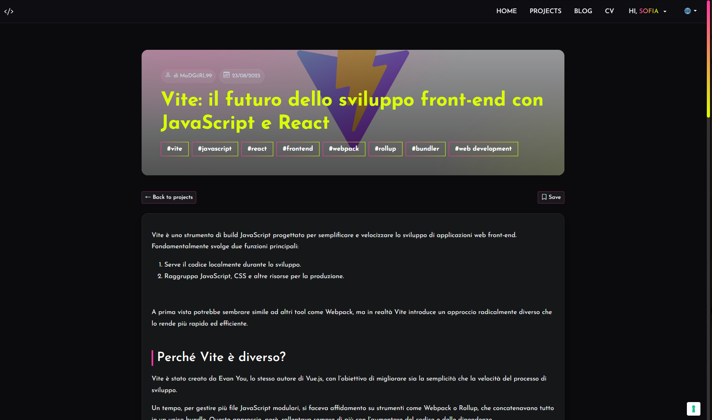
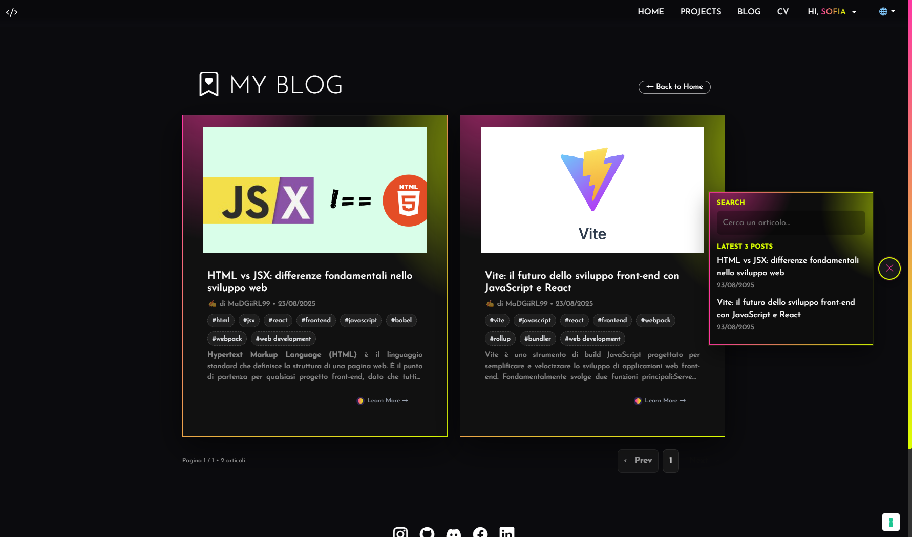
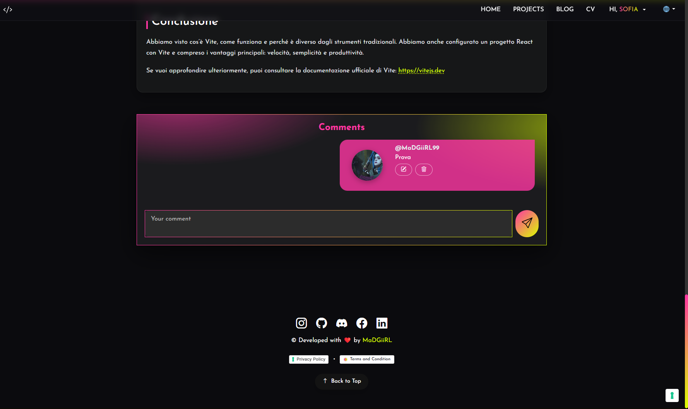
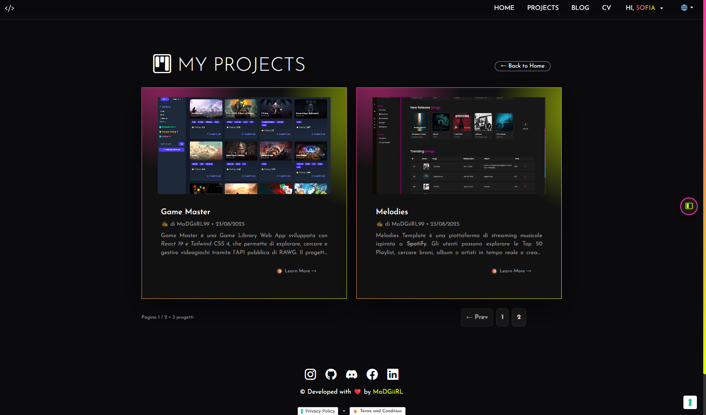
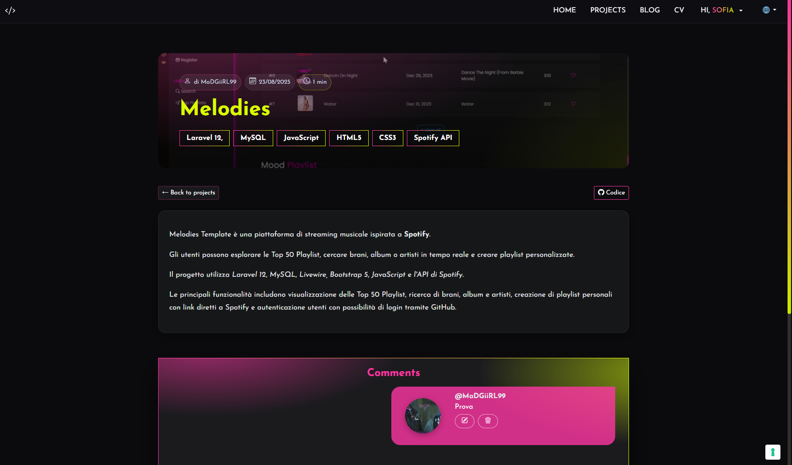
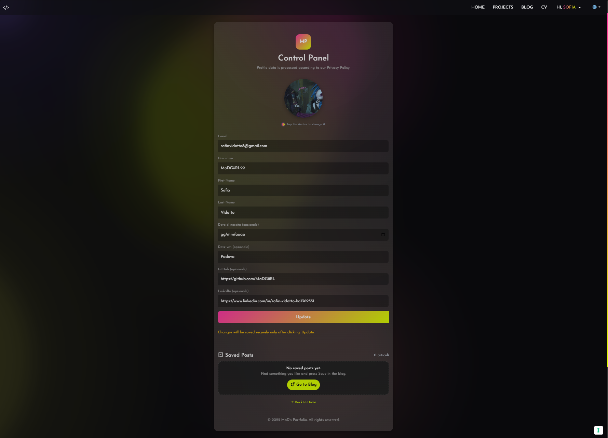
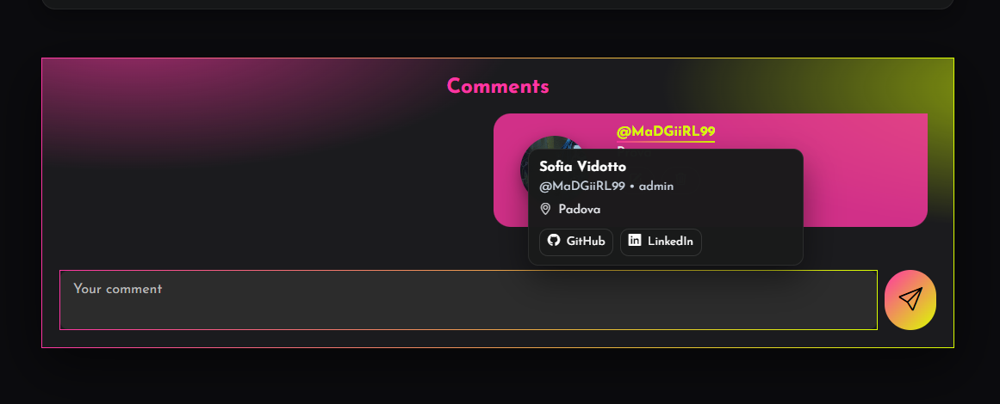
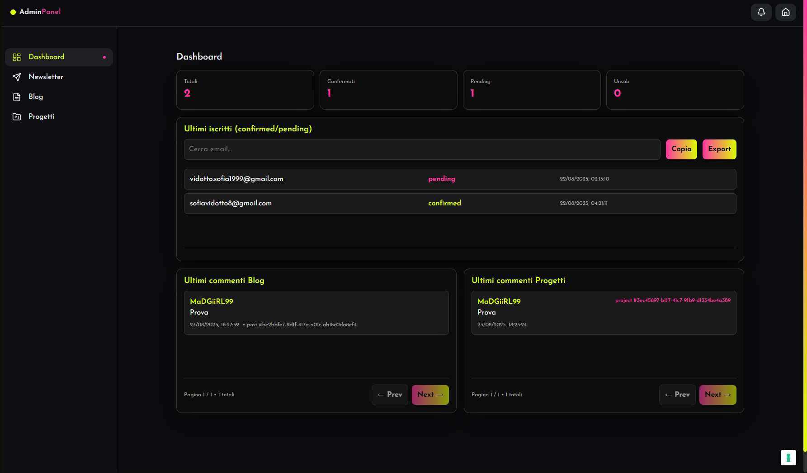
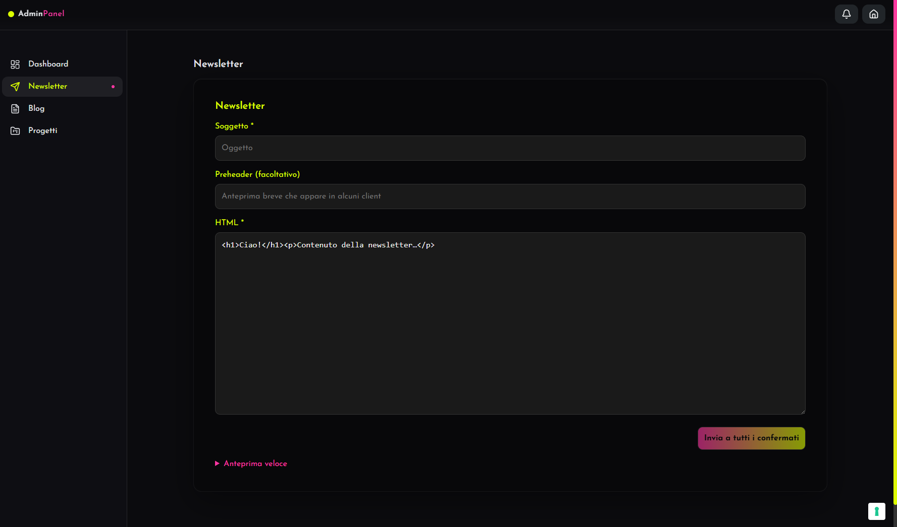
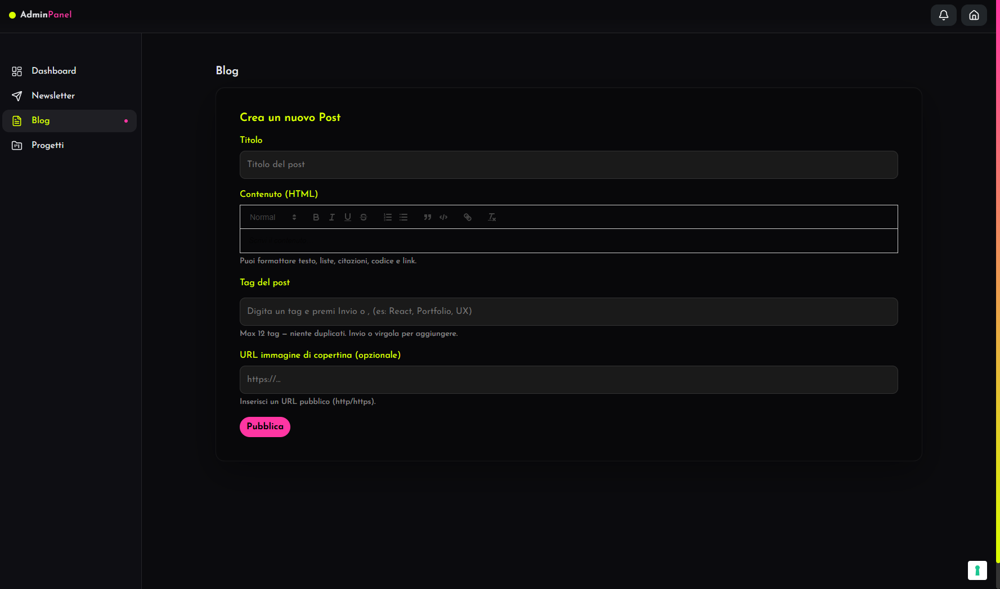

# 🌟 Portfolio Personale - Sofia

## 🛠 Tecnologie utilizzate

- ⚛️ **React 19** + **Vite**
- 🛤 **React Router v7**
- 🌐 **HTML5**, **CSS3**, **JavaScript (ESNext)**
- 🎨 **Bootstrap 5** + **Bootstrap Icons**
- 🎞 **Framer Motion** (animazioni fluide)
- ✨ **SweetAlert2** (alert e modali interattive)
- 📝 **Quill Editor** (gestione contenuti blog/progetti)
- 🌍 **i18next** + **react-i18next** (multilingua con rilevamento automatico e backend)
- 📧 **EmailJS**,  **Nodemailer** (gestione email e notifiche)
- 🗄 **Supabase** (autenticazione, database, gestione profili e newsletter)
- 🔒 **Zod** (validazione form e dati)
- 🌐 **Express**, **CORS**, **body-parser**, **dotenv** (API e backend di supporto)
- 📊 **@vercel/analytics** (analisi e metriche di utilizzo)
- 🧼 **DOMPurify** (sanitizzazione contenuti utente)
- 📅 **Day.js** (gestione date e formattazioni)

---

## 📖 Descrizione del progetto

Il mio **portfolio personale** è una **web app full stack** sviluppata con **React + Supabase** che funge da **vetrina interattiva delle mie competenze**.  
Non è solo una raccolta di progetti, ma un **ambiente dinamico e multilingua** che integra:

- ⚡ **frontend moderno e animato**
- 🗄 **backend con Supabase e API custom**
- 🧑‍💻 **pannello admin e gestione contenuti**

---

## 🔥 Funzionalità principali

- 🌍 **Multilingua (i18next)**
- 📧 **Newsletter avanzata** con iscrizioni, conferme, disiscrizioni, invii via admin panel
- 📝 **Blog con articoli e commenti** (editor Quill, live commenti)
- 📂 **Progetti con pagine dedicate** e commenti interattivi
- 👤 **Profilo utente / CV interattivo** con gestione dati e account
- 🔐 **Admin Dashboard** con statistiche, iscritti, esportazioni, ultimi commenti su blog e progetti
- ⚙️ **Backend Express** per API custom, email via Nodemailer
- 📜 **Privacy & Policy** con Iubenda

---

## 📸 Screenshot

### 🏠 Homepage


---

### 📧 Newsletter & Iscrizioni


---

### 📝 Blog

<div align="center">
  
  
  
</div>

---

### 📂 Progetti

<div align="center">
  
  
</div>

---

### 👤 Profilo utente

<div align="center">
  
  
</div>


---

### 🔐 Admin Dashboard

<div align="center">
  
  
  
</div>

---

## 🎨 Obiettivi

Questo portfolio vuole dimostrare:

- La mia identità come **full stack web developer**
- La capacità di unire **frontend moderno (React, Framer Motion)** con **backend e servizi esterni (Supabase, API, email)**
- Attenzione a **UX/UI, sicurezza e compliance legale**
- Versatilità grazie alla **multilingua** e alla **gestione dinamica dei contenuti**

---

## 🚀 Avvio del progetto

```bash
# Clona il repo
git clone <repo-url>

# Installa le dipendenze
npm install

# Avvia in modalità sviluppo
npm run dev


```
